# SQL Helpdesk Analytics — Local SQLite Lab

This beginner-friendly lab runs **locally** with SQLite (no server install). You’ll create a helpdesk database from CSVs, then run analytics queries for tickets, SLAs, agents, and customers.

## What’s inside
```
SQL_Helpdesk_Analytics_Lab/
├─ data/
├─ media/
│  ├─ 01_Setup_CMD_Path.png
│  ├─ 01_Setup_Import.png
│  ├─ 01_Setup_Tables.png
│  ├─ 01_Setup_Schema.png
│  ├─ 02_Data_Agents.png
│  ├─ 02_Ticket_Count.png
│  ├─ 03_Ticket_Volume.png
│  ├─ 04_Resolution_Time.png
│  ├─ 05_SLA_Compliance.png
│  ├─ 06_Agent_Workload.png
│  ├─ 07_Top_Customers.png
│  ├─ 08_Ticket_Age.png
│  ├─ 09_Lab_Structure.png
│  └─ 10_Helpdesk_DB.png
├─ setup.sql
├─ queries.sql
├─ README.md
└─ helpdesk.db

```
# SQL Helpdesk Analytics — SQLite Local Lab

## 🎯 Objective
Hands-on lab demonstrating SQL analytics skills using a realistic helpdesk database.  
Focus: ticket volume, SLA compliance, agent workload, and customer insights.

## 🧰 Tools
- SQLite 3
- Windows Command Prompt
- CSV datasets (imported locally)

## 🧩 Database Overview
Tables:
- `agents` – helpdesk agents and teams
- `customers` – client information
- `sla_policies` – SLA response targets
- `tickets` – main incident records
- `ticket_updates` – activity logs

## 🧮 Queries Run
1. Ticket volume by priority  
2. Average resolution time  
3. SLA compliance by priority  
4. Agent workload  
5. Top customers by volume  
6. Open ticket age analysis

## 🧾 Evidence

---

# 📸 Project Evidence & Results

## Objective
Hands-on lab demonstrating SQL analytics skills using a realistic helpdesk database.

## Evidence
| Step | Description | Screenshot |
|------|--------------|-------------|
| 1 | Command Prompt opened in lab directory | 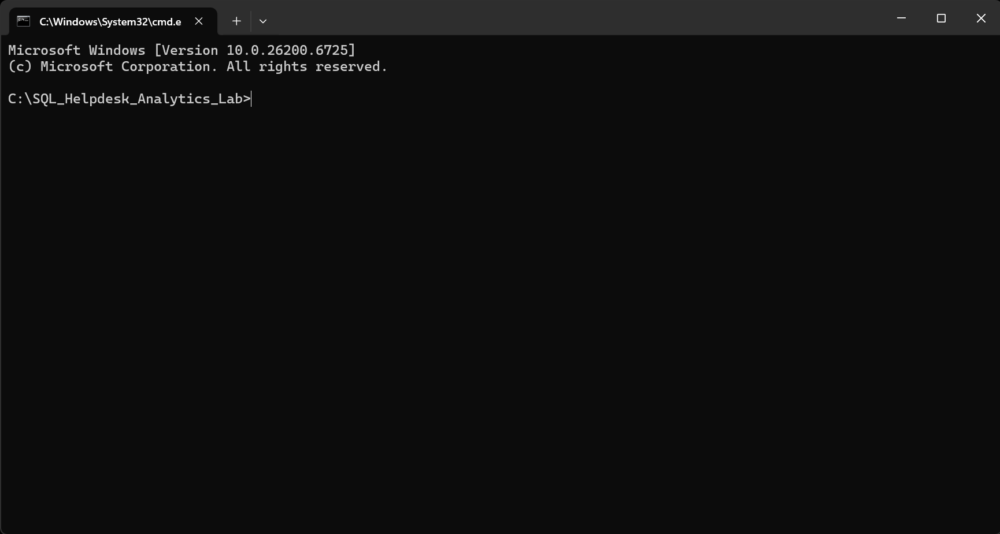 |
| 2 | Executed setup script and imported CSV data | 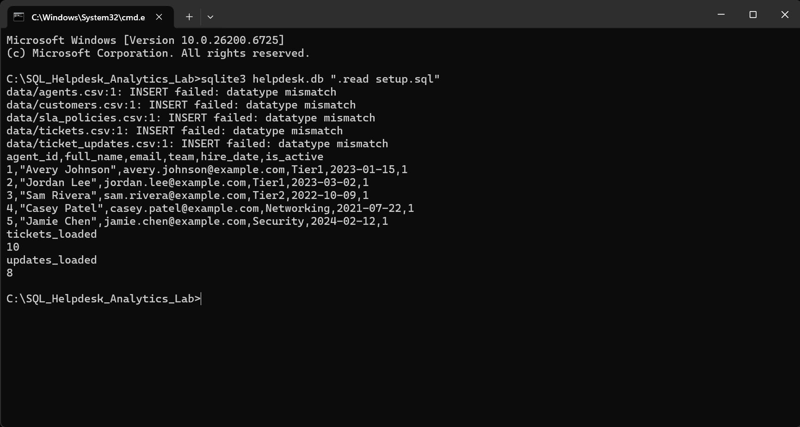 |
| 3 | Verified tables were created using `.tables` | 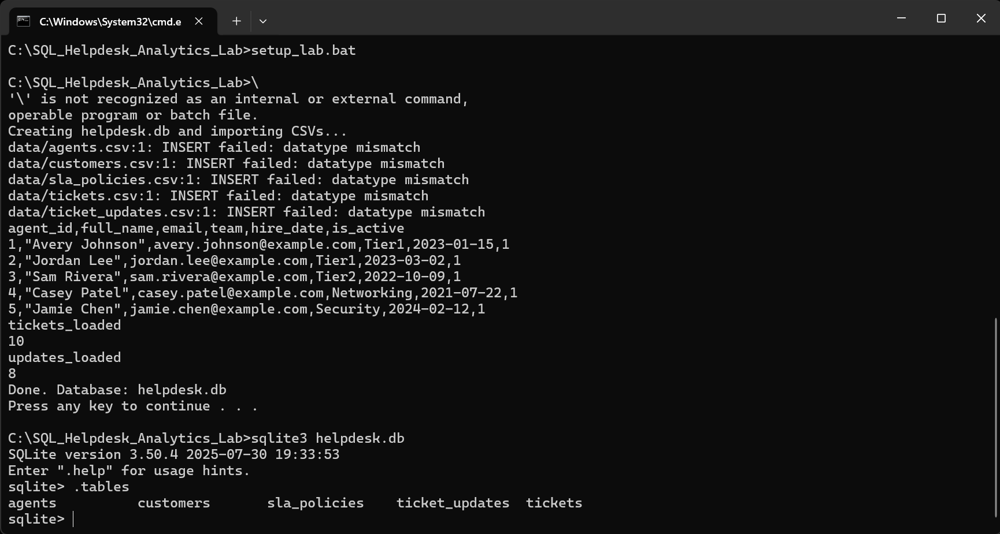 |
| 4 | Displayed schema for Agents table using `.schema agents` | 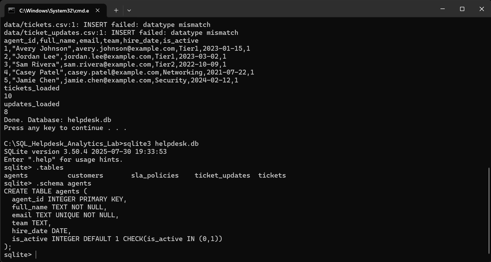 |
| 5 | Verified sample Agents data loaded correctly | 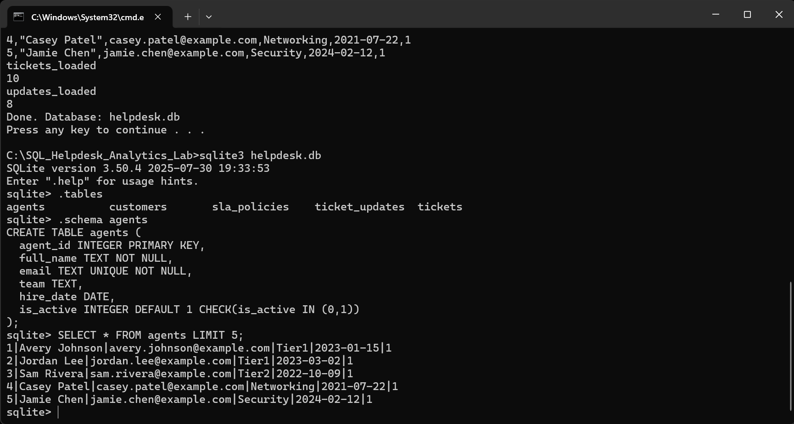 |
| 6 | Verified total Tickets count | 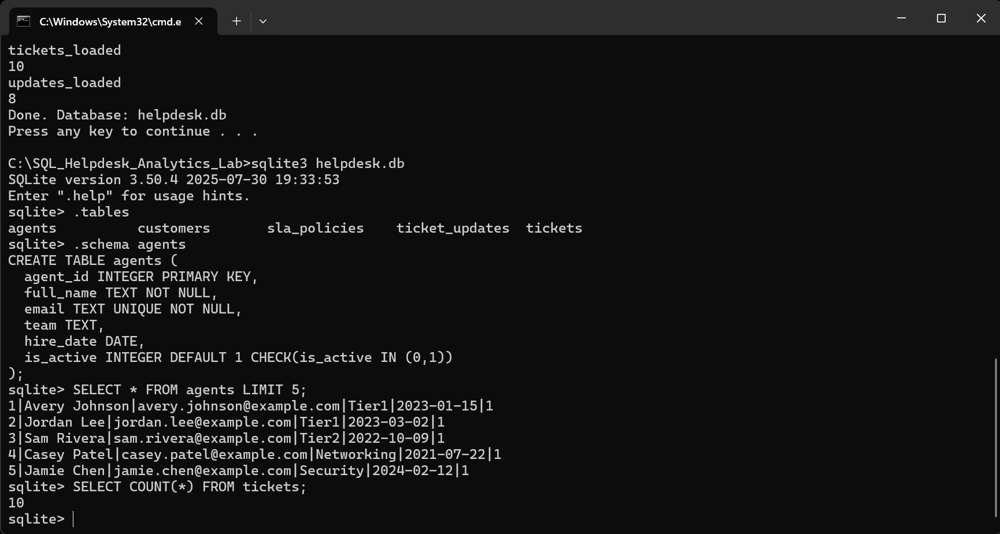 |
| 7 | Ticket volume by priority | 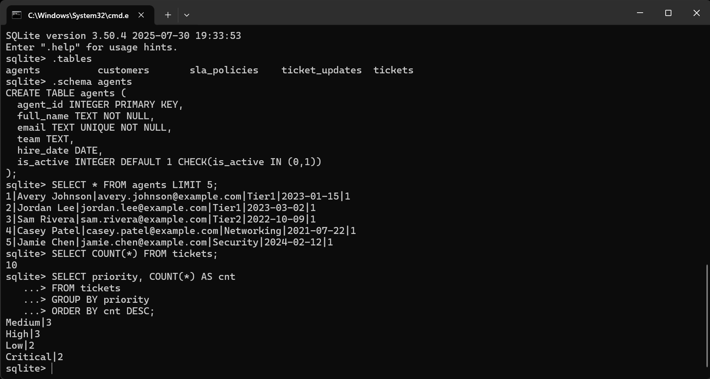 |
| 8 | Calculated average resolution time (in hours) | 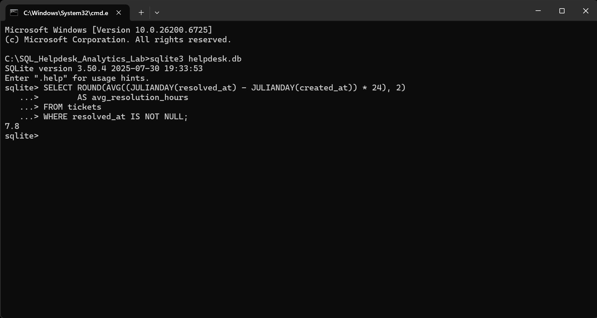 |
| 9 | SLA compliance analysis by priority | 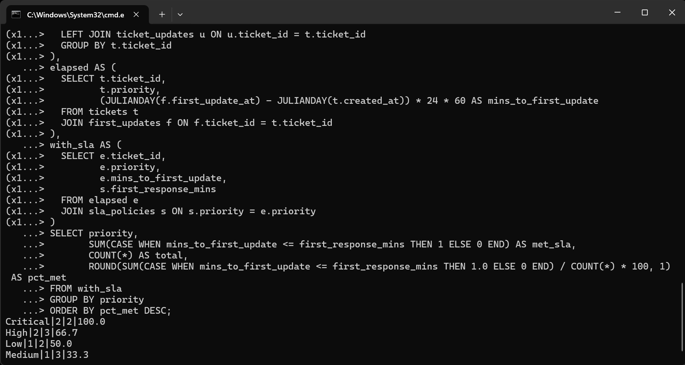 |
| 10 | Agent workload summary (active tickets) | 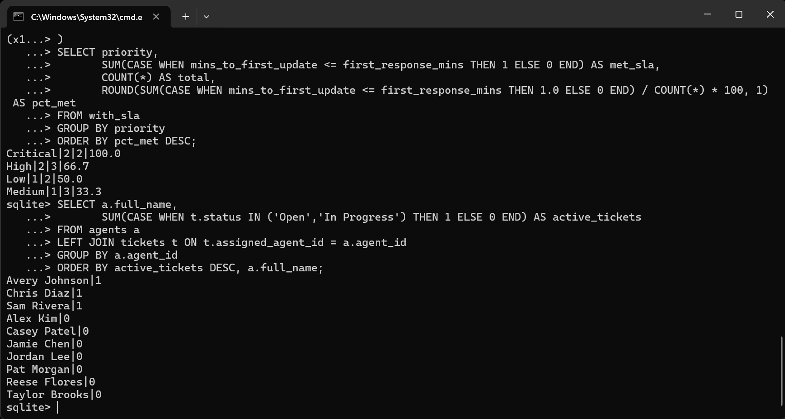 |
| 11 | Top customers by ticket volume | 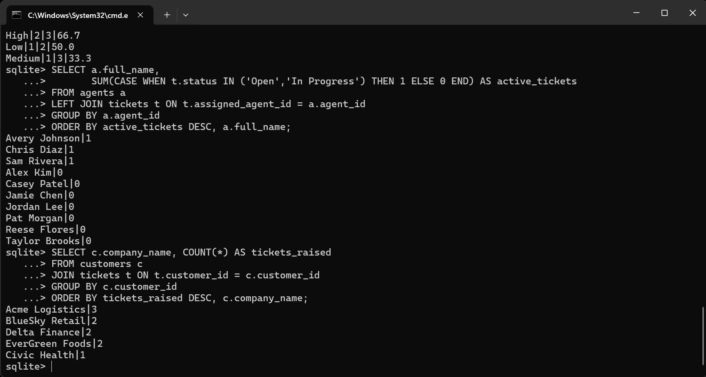 |
| 12 | Ticket age analysis for unresolved tickets | 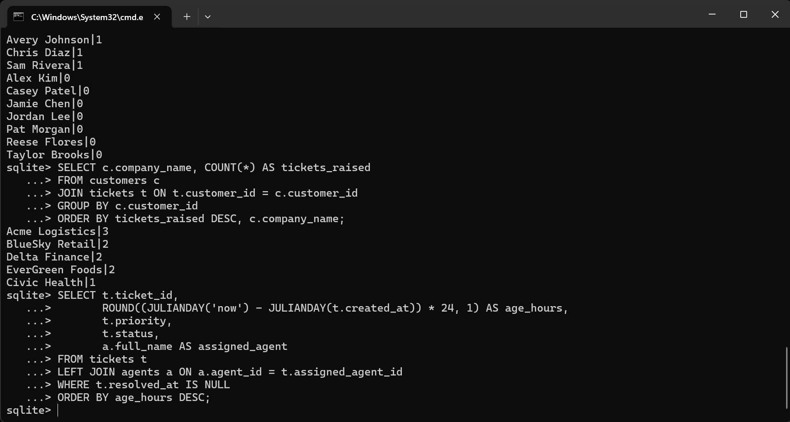 |
| 13 | Verified full lab folder structure | 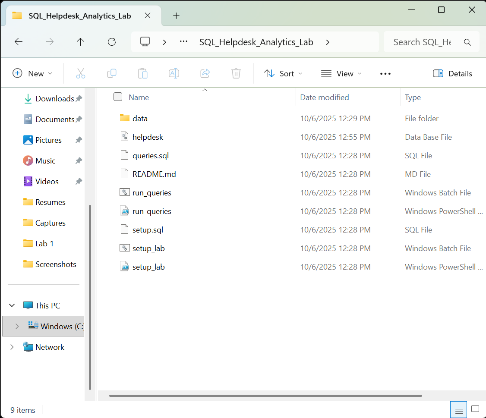 |
| 14 | Confirmed helpdesk.db database file created |  |


## Takeaways
- Practiced SQL joins and aggregates
- Built SLA metrics using CTEs
- Created realistic helpdesk analytics

---

**Created by:** Kamal Bush  
[GitHub Profile](https://github.com/kbush2)  
[LinkedIn Profile](https://www.linkedin.com/in/kamal-bush/)

